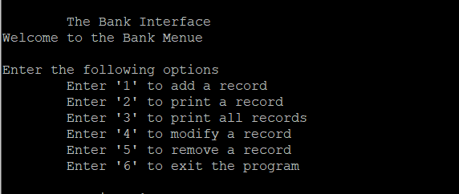

This was the my project for ICS 212. This course reinenforced our data structure by using the C language on unix. When I first learned this language the coding style was almost identical to Java. That was when I then realized that Java was actually built ontop of this language. The big difference between the two was the use of pointers and the use of memory. When I first learned java, I did not have to worry about memory or pointers. Another Challenge to the course was we did not use an IDE. Instead we were introduced to unix. So in addition to learning C we also learned scripting on unix. We had to create files to write out our program and do the linking and compiling ourselves by using the script commands. Taking this course taught me the behind the scene when I was programming Java in Eclipse. 

For this project it tested our knowledge of C and unix. The goal of this program was to implement a singly linked list of bank records. The condition was while the program ran it must be able to allow a user to add a record, delete a record, print all of the record or just a specific record, delete a record and to quit the program. We did not implement any graphics, instead we used print to display the menue as the program ran. Then when the program closes all those data will be saved onto a file, where that file will be read when the program starts. So this ment, the program will always start with some data. We also have to take account a user friendly interface. We had to made sure that the interface was easy to read and to intereact with.

Implementing this program taught us the importance of taking less time coding and more time creating a psuedocode. And when a bug occurs we would trace. All of this would make you code more efficiently. As a result, these two things made it possible for me to create this programm with little issues.

Source: <a href="https://github.com/buccatm/ICS212-C"><i class="large github icon "></i>ICS 212 project 1</a>

