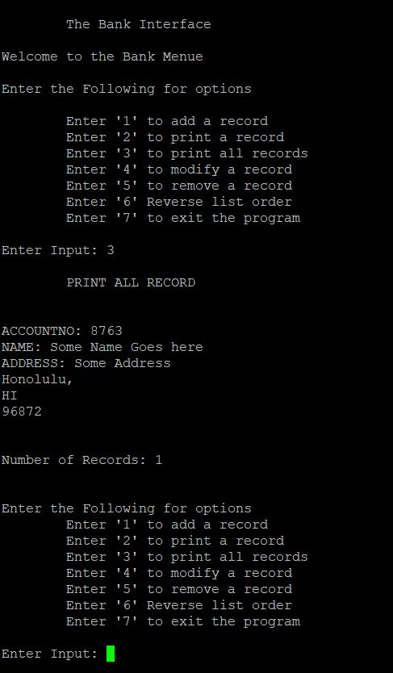

Project 2 was the final project for ICS 212. The project is still the same with the same requirement, that is it be a singly linked list. However, the catch now is the whole program must be implemented in C++. Ontop of that a recursive function was added to allow the user to put the entire list in reverse. The C++ was just like Java without the training wheels. C++ still had pointers just like C, but now classes are involved. 

Even though this project was almost identical to <a href="https://buccatm.github.io/projects/project-1">project 1</a>, I was still not able to just copy paste everything from C to this project. Almost all of the main functions had to be redone from scratch. This included the interface. For this project I had encountered more bugs than the previous project. Luckliy these bugs forced my program to crash. This may sound weird, but one thing I learned from this class is having a program crash is better than having in loop forver. There were lots of bug fixing in this project such as memory leak, but eventually I was able to get the program to work just.

The skill I learned from this project is time management. Coding everything the day before the deadline was just not practical and should always be avoided. I would always spend each day coding one function at a time. This way I do not get overwhelmed and helps me to avoid as much bugs as possible. On occasions that I do catch a bug and I cannot solve it, I would first trace it to solve the problem myself. And if it still persist I ask for help. This was the reason how I managed to get everything done on time with program working as it should.

Source: <a href="https://github.com/buccatm/ICS212-Project-2"><i class="large github icon "></i>ICS 212 project 2</a>
