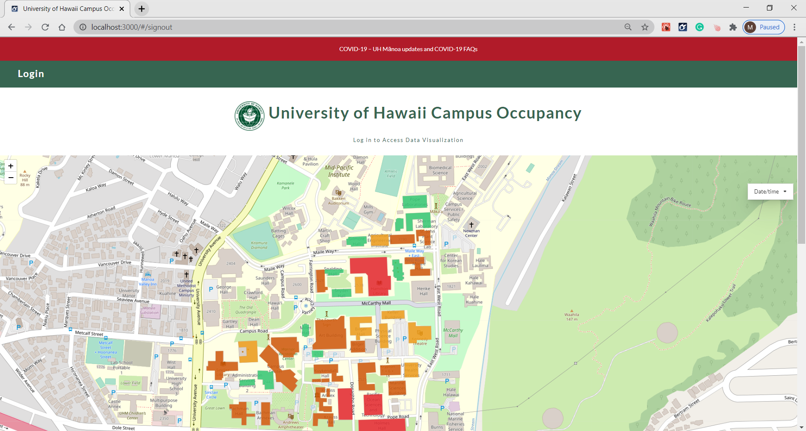
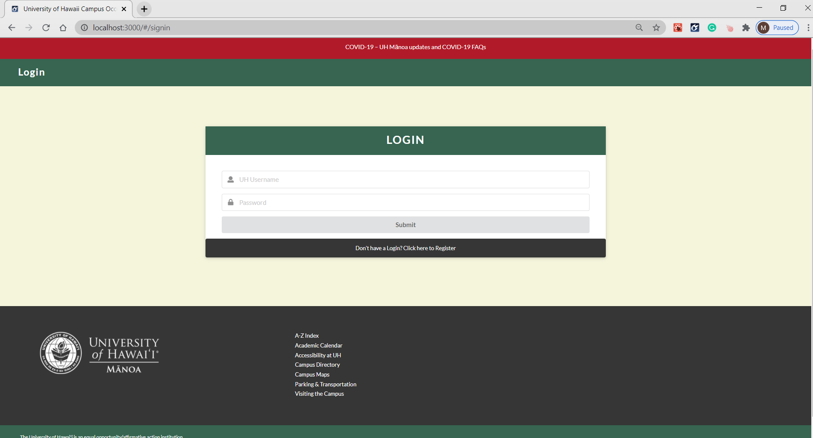
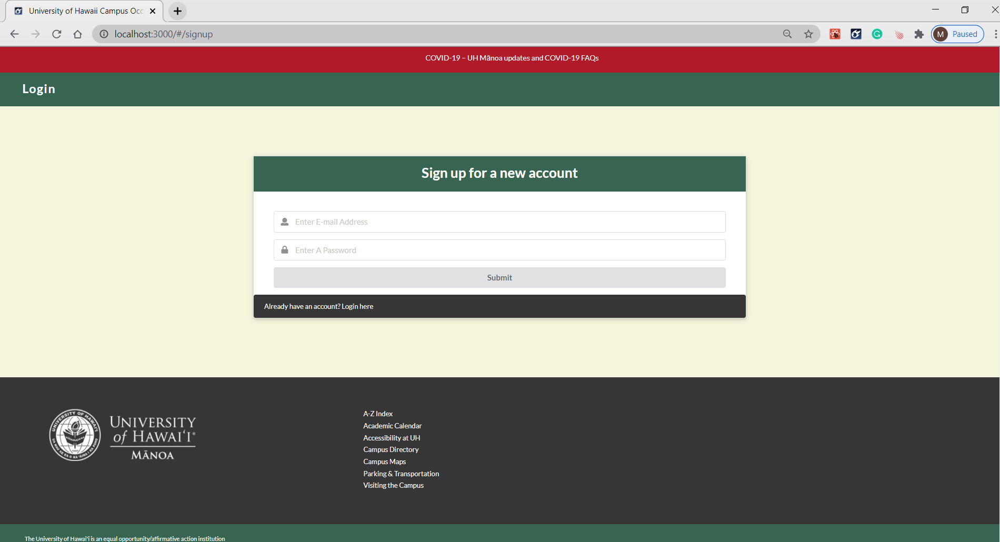
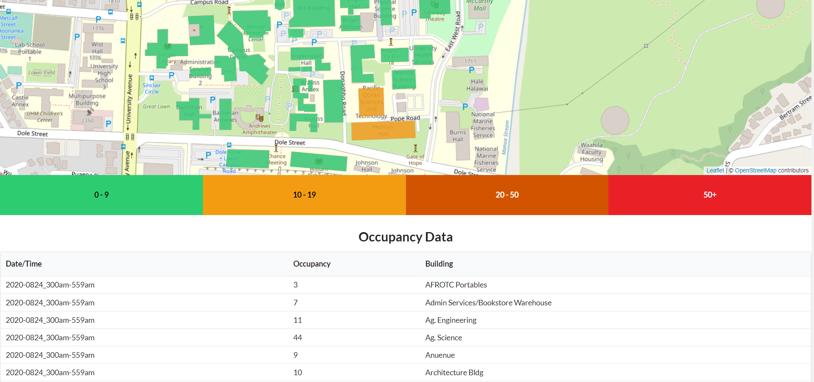
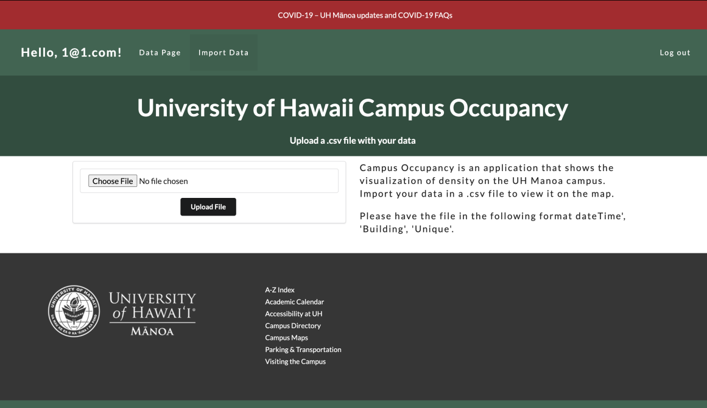

This web application was meant for the HACC 2020 competition. Unfortunately, we ended up deciding to forfeit because of our busy schedules. But this did not stop us from finishing it. We continued to work on this application as our final project. For this Project I collaborated with <a href="https://calianafortin.github.io/">Caliana Fortin</a> and <a href="https://fredstraub.github.io/">Fred Straub</a>.

The goal of the application is to visualize occupancy of the University of Hawaii at Manoa Campus in hopes of assisting in scheduling and assessing social distancing and group density. For this web application we created 4 pages, the landing page, home page, login, sign in and import page.

In our landing page, a map is shown that visualizes the occupancy.  Selecting any of the highlighted buildings will present a popup of the occupancy for that building and the name of the building. There is a drop down tab that allows the user to pick one of the date times. The data will then display on the map the occupancy of that date time. The data we used for this project was provided by <a href="https://github.com/HACC2020/data/tree/main/uh_occupancy">HACC</a>.

Of course we wanted to make this for the campus, so we needed a way for admins to login. For this we used the template provided to allow the user to log in and also sign in. Once the users logs in or signed up for an account they will be taken to the home page.

The Home page will display a similar map with the drop downs. However, a table will also be displayed to show more information, such as the date time, occupancy value and the building. The last page is the import data page. This page will take a csv file to import into the database. However the csv file must contain the required properties.

Creating the import page was one of my task. Originally we wanted a way to upload both a json file and a csv file. However, I was only able to find a way to upload a csv file into our database. So we decided to just stick with the csv file. But there were some tasks that demanded everyone's attention. Some of these task was trying to display our datas from Mongo onto the map and finding a way to display the data onto the map based on the time selected by the dropdown. These two tasks were by far the challenging part of this project. Fortunately we were able to find a way to get these two to work, it just involved a lot of googling and asking smart questions.

This project is a step up from my previous experience with collaborating in a <a href="https://buccatm.github.io/projects/SpaceShip-Game">group Project</a>. It introduces to me a new way of collaborating by using Github. Prior to using Github, my first group project relied on emailing each other to send the updated version of the code. Luckily at the time the project was just a small and simple game, but just imagining how it would have been if the project was massive, made me glad about using Github. The most frustrating part of this project was definitely trying to fix bugs and issues especially the map. There was lots of researching involved in trying to fix the bugs. However at the end of it all, I was finally able to work with one of my interests, and that is to develop a working website.

GitHub Repository: <a href="https://github.com/campus-occupancy/campus-occupancy"><i class="large github icon "></i>Campus Occupancy Application</a>

GitHub IO: <a href="https://campus-occupancy.github.io/"><i class="large github icon "></i>Campus Occupancy</a>

