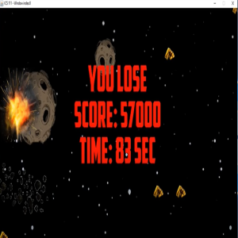

This was the very first game I worked on. It was created by Braden, Caelan and myself. It was a group project so we divided the work by having one person create the obstacle, on person creates the space ship, and one creates the window to display the game. We would still help each other if one of us was struggling. The game is a simple 2d dodge the asteriod but as time passes by the game speed increases. This means that the obstacle would be moving faster overtime. The goal is to collect the gold points and to last as long as possible.

I was given the task of creating the obstacles. Initially, I used the EZCircle from the EZ java file as a place holder. Then I would try to make the asteroid appear randomly on the far right of the screen and have it move at the opposite direction. The Challenging part was getting the obstacle to appear correctly on the screen. There would be times when the image would disappear then reappear or render the asteroid at the wrong part of the screen. The end result of our project was it worked but with some glitches.

This project made me realized the difficulty of creating video games. There are a lot of problems that would occur at any time. Many of the times you would be looking at it for hours trying to debug it. Also the code itself is very messy. This gave me the impression that I needed some more practice. I was a beginner when I was working on this project. But now that I have a bit more experience in coding, I'm looking forward to improving this.

Source: <a href="https://github.com/buccatm/Java-Game3"><i class="large github icon"></i>Ship Game</a>
